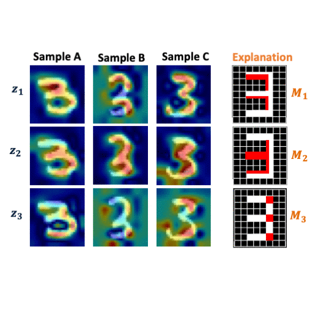

# ExpVAE 


## Overview
This repository provides training and testing code and data for CVPR 2020 [paper](https://arxiv.org/pdf/1911.07389.pdf):

"Towards Visually Explaining Variational Autoencoders", Wenqian Liu, Runze Li, Meng Zheng, Srikrishna Karanam, Ziyan Wu, Bir Bhanu, Richard J. Radke, and Octavia Camps

Further information please contact Wenqian Liu at liu.wenqi@northeastern.edu, Runze Li at rli047@ucr.edu .

## Requirements
* [PyTorch](https://pytorch.org/) 1.0 
* Python 3.7
* Cuda 9.0

## Running codes
* Start trainning a one-class VAE with default settings by call:
```bash
python train_expVAE.py 
```
other options are:
```bash
[-h] [--result_dir DIR] [--ckpt_dir DIR] [--batch_size N] [--epochs N] 
     [--seed S] [--resume PATH] [--latent_size N] [--one_class N]
```
Here result_dir saves validating visualizations; ckpt_dir saves best model after each epoch; latent_size decides VAE's latent vector shape; one_class decides which digit to be used as inlier to train on.

* Start testing with default settings by call:
``` bash
python test_expVAE.py
```
other options are:
```bash
[-h] [--result_dir DIR] [--batch_size N] [--seed S]
     [--latent_size N] [--model_path DIR] [--one_class N]
```
Here one_class decides the outlier digit, so that expVAE will generate anomaly localization attention maps, in which high response regions denote the difference between the outlier digit and the inlier digit.

Pretrained models for MNIST can be found [here](https://drive.google.com/file/d/1LLJkAEVA7G5ktzo7EfIsyHyHDGTIVxyG/view?usp=sharing)

## License and Citation
The use of this software is RESTRICTED to **non-commercial research and educational purposes**.

```
@article{liu2019towards,
  title={Towards Visually Explaining Variational Autoencoders},
  author={Liu, Wenqian and Li, Runze and Zheng, Meng and Karanam, Srikrishna and Wu, Ziyan and Bhanu, Bir and Radke, Richard J and Camps, Octavia},
  journal={arXiv preprint arXiv:1911.07389},
  year={2019}
}
```
